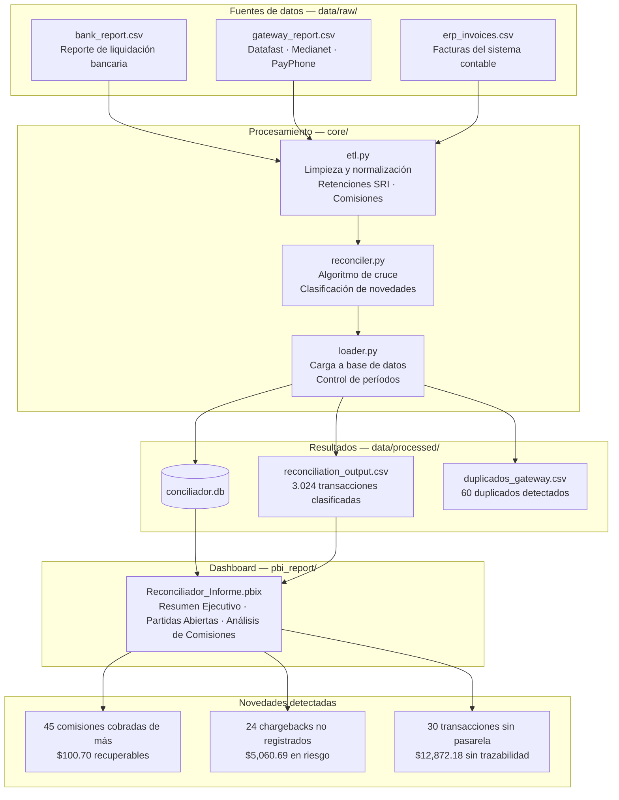

# Conciliador de Pasarelas de Pago
## Qué detecta, por qué importa y cómo actuar


---

## El problema que resuelve

Cuando una empresa recibe pagos con tarjeta de crédito, intervienen tres sistemas distintos que deben coincidir al final del mes:

- **El ERP o sistema contable** registra cada venta en el momento en que ocurre. Muestra el valor bruto de la factura — lo que el cliente pagó.
- **La pasarela de pago** (Datafast, Medianet, PayPhone) procesa la transacción y cobra su comisión por el servicio.
- **El banco** recibe los fondos de la pasarela, aplica las retenciones que exige el SRI y deposita el valor neto en la cuenta del comercio.

El problema es que estos tres sistemas no se comunican entre sí de forma automática. El equipo contable tiene que cruzar manualmente los reportes de los tres — un proceso que con volúmenes medianos puede tomar entre 8 y 20 horas semanales y que, inevitablemente, genera errores humanos.

> **Nota sobre los datos:** Este proyecto usa datos sintéticos generados con Faker. Los nombres de empresas, RUCs y transacciones son ficticios. El problema de negocio que modela — comisiones cobradas de más, chargebacks no registrados, transacciones sin trazabilidad — es completamente real y ocurre en cualquier empresa que procese pagos con tarjeta.

---

## Stack tecnológico

| Capa | Tecnología | Uso |
|---|---|---|
| Procesamiento | Python · Pandas · NumPy | ETL, algoritmo de cruce, detección de novedades |
| Almacenamiento | SQLite · SQLAlchemy | Resultados con histórico por período |
| Visualización | Power BI | Dashboard ejecutivo · Partidas abiertas · Análisis de comisiones |
| Generación de datos | Faker | Datos sintéticos con errores reales inyectados |

---

## Pipeline del proyecto


 
---

## Estructura del repositorio

```
Payment_Reconciler/
│
├── Readme.md
├── .gitignore
├── requirements.txt
├── main.py                         ← punto de entrada del pipeline
│
├── src/
│   ├── config.py                   ← rutas y constantes del negocio
│   └── log_config.py               ← configuración centralizada de logging
│
├── core/
│   ├── etl.py                      ← limpieza y normalización
│   ├── reconciler.py               ← cruce y clasificación
│   └── loader.py                   ← carga a SQLite 
│
├── data/
│   ├── raw/                        ← archivos fuente
│   │   ├── bank_report.csv
│   │   ├── gateway_report.csv
│   │   └── erp_invoices.csv
│   └── processed/                  ← salidas del pipeline
│       ├── reconciliation_output.csv
│       ├── duplicados_gateway.csv
│       └── conciliador.db          
│
├── images/                         ← capturas del proyecto
│
├── sample_output/                  ← resultado de ejemplo (estático, versionado)
│   ├── reconciliation_output.csv
│   ├── duplicados_gateway.csv
│   ├── conciliador.db
│   └── README.md
│
├── log/
│   └── process.log
│
└── pbi_report/
    ├── Reconciliador_Informe.pbix
    └── ux_templates/
        ├── pbi_page_1.JPG          ← Resumen Ejecutivo
        ├── pbi_page_2.JPG          ← Partidas Abiertas
        └── pbi_page_3.JPG          ← Análisis de Comisiones
```
## Cómo clonar y ejecutar el proyecto

**Requisitos previos**

- Python 3.12 o superior
- Git

**Pasos**

```bash
git clone https://github.com/<usuario>/Payment_Reconciler.git
cd Payment_Reconciler

python -m venv .venv
source .venv/bin/activate     # En Windows: .venv\Scripts\activate

pip install -r requirements.txt
```

El repositorio incluye datos de prueba en `data/raw/` , por lo que el proyecto puede ejecutarse de inmediato sin necesidad de archivos adicionales:

```bash
python main.py
```

Esto genera automáticamente:

- `data/processed/reconciliation_output.csv` y `duplicados_gateway.csv` — resultado de la corrida actual
- `data/processed/conciliador.db` — base de datos histórica (se crea sola si no existe)
- `log/process.log` — registro detallado de la ejecución

Para usar el proyecto con datos reales, se  reemplazan los tres archivos en `data/raw/` (`bank_report.csv`, `erp_invoices.csv`, `gateway_report.csv`) manteniendo exactamente esos nombres, y volver a correr `python main.py`.

> Las carpetas `.venv/`, `__pycache__/` y `log/*.log` están excluidas del repositorio mediante `.gitignore` — cada persona las genera al clonar y ejecutar el proyecto.

---

## Resultado de ejemplo — `sample_output/`

`data/processed/` es la carpeta de trabajo del pipeline, su contenido se sobrescribe en cada corrida y por eso está excluido del repositorio mediante `.gitignore`. Para que cualquiera pueda ver el resultado real sin tener que clonar, instalar dependencias y ejecutar nada, el repositorio incluye una copia estática en `sample_output/`:

- `reconciliation_output.csv` y `duplicados_gateway.csv` — salida de una corrida real sobre los datos sintéticos de `data/raw/`
- `conciliador.db` — la base de datos resultante, se abre directamente con DBeaver, SQLite CLI o cualquier cliente compatible con SQLite

Esta carpeta es una fotografía fija de un momento específico, no un artefacto que se actualiza junto con el código — así lo indica el `README.md` dentro de `sample_output/`. Para obtener un resultado actualizado con el código actual, corre `python main.py` como se explica arriba.

---

## Ejecución
 
El pipeline está pensado para que lo opere directamente el responsable de conciliació a traves de un archivo .bat que puede ser programdo o ejecutado directamente por el usuario, sin necesidad de conocimientos de programación ni de un editor de código. Una vez configurado el entorno una única vez, el proceso semanal se reduce a reemplazar los archivos fuente y hacer doble clic.
 
**Configuración inicial (una sola vez)**
 
```cmd
python -m venv .venv
.venv\Scripts\activate
pip install -r requirements.txt
```
 
**Ejecución semanal**
 
1. Reemplazar los tres archivos fuente en `data/raw/` con los reportes actualizados del banco, la pasarela y el ERP.
2. Ejecutar `ejecutar_conciliacion.bat` con doble clic.
3. Abrir el dashboard en Power BI y presionar **Actualizar**.
```bat
@echo off
cd /d "RUTA_DEL_PROYECTO"
call .venv\Scripts\activate
python main.py
echo Proceso completado. Abre el .pbix y presiona Actualizar.
pause
```
 
El script activa el entorno virtual y corre `main.py`, que orquesta todo el pipeline en un solo paso: concilia, guarda los resultados y actualiza la base de datos. No requiere terminal, ni comandos, ni supervisión técnica .

## Cómo se actualiza el histórico en la base de datos

El pipeline está pensado para correr de forma recurrente (semanal, en este proyecto) sin perder ni duplicar información. Esto se resuelve en `core/loader.py` mediante un mecanismo de actualización por `tx_id`, no por fecha ni por período.

**Por qué no se duplica al correr varias veces**

Los reportes fuente (`bank_report.csv`, `erp_invoices.csv`, `gateway_report.csv`) llegan acumulados desde el inicio del mes hasta la fecha de la corrida — no solo las transacciones nuevas. Esto significa que cada ejecución del pipeline recalcula el estado real y actualizado de todas las transacciones del mes, incluyendo aquellas que estaban pendientes en una corrida anterior y ya se resolvieron. Por ejemplo: una venta que en la semana 1 no tenía contraparte en el banco (quedaba como `PENDIENTE`), y en la semana 2 sí aparece liquidada, se reclasifica automáticamente como `CONCILIADA` sin intervención manual.

Antes de insertar los nuevos resultados, `loader.py` elimina de la base únicamente las filas cuyo `tx_id` coincide con los que trae la corrida actual, y luego inserta el resultado completo. En la práctica esto logra el efecto de una actualización tipo *upsert*: los registros que cambiaron de estado se sobrescriben con su versión más reciente, y los que no cambiaron no se tocan.

---

## Dashboard de Power BI — Reporte de Conciliación

Esta sección presenta las pantalla principal del tablero diseñado en Power BI, el cual automatiza el monitoreo y control del pipeline de conciliación.

### Informe Conciliacion 

Informe que consolida los principales indicadores: montos totales procesados, volumen de transacciones conciliadas y alertas tempranas sobre diferencias detectadas entre las fuentes.Inlcuye tablas con detalles  para el equipo contable enfocado en la investigación de novedades. Permite identificar rápidamente transacciones duplicadas, registros huérfanos o comisiones mal calculadas por la pasarela de pagos.


## Cómo fluye el dinero — la base para entender las novedades

Antes de explicar los errores que el sistema detecta, es importante entender cómo fluye el dinero en cada transacción con tarjeta.

Cuando un cliente paga $500 con su tarjeta Visa, el dinero pasa por tres descuentos antes de llegar al comercio: la comisión de la pasarela, la retención de IVA y la retención en la fuente de renta que exige el SRI.

```
Cliente paga              $500.00
Comisión Datafast (3.5%)  - $17.50
Retención IVA (4.5%)      - $22.50
Retención renta (1%)      - $  5.00
                          ─────────
Depósito recibido         $455.00
```

Este desfase entre lo que registra el ERP ($500) y lo que deposita el banco ($455) es completamente normal y esperado. El conciliador conoce estas reglas y las aplica automáticamente para cada transacción — eso le permite distinguir entre una diferencia esperada y un error real.

---

## Las tres novedades que el sistema detecta

De un total de 3.024 transacciones analizadas en el período julio-diciembre 2024 (3.000 ventas originales + 24 reversiones posteriores), el sistema identificó 99 casos que requieren atención:


```
Transacciones conciliadas correctamente  →  2.925  (96.7%)
Comisiones cobradas de más               →     45  casos
Chargebacks no registrados en ERP        →     24  casos
Transacciones sin confirmar en pasarela  →     30  casos
```

---

### Novedad 1 — Comisiones cobradas de más por la pasarela

**Qué significa**

La pasarela cobró un porcentaje de comisión mayor al acordado en el contrato. Por ejemplo, el contrato con Datafast establece una tasa del 3.5%, pero en 45 transacciones cobró entre 4.0% y 5.0%.

**Por qué ocurre**

Las pasarelas aplican tarifas distintas según el tipo de tarjeta, el país de emisión o la categoría del comercio. Cuando el sistema clasifica incorrectamente una transacción, aplica una tarifa más alta. Sin un sistema de verificación, ese sobrecargo pasa desapercibido.

**El impacto económico**

En el período analizado las pasarelas cobraron $100.70 más de lo estipulado en los contratos. Este monto es completamente recuperable mediante un reclamo formal.

**Cómo lo resuelve el contador**

El reporte muestra por cada transacción el monto de la factura, la comisión que debía cobrarse según contrato, la comisión que se cobró realmente y la diferencia a reclamar.

Con esa información el contador:

1. Agrupa las diferencias por pasarela para obtener el total a reclamar a cada una.
2. Genera una carta de reclamo formal con el detalle de cada transacción afectada, la referencia del contrato y el monto total a devolver.
3. Una vez que la pasarela procesa la devolución, registra el ajuste contable correspondiente.

---

### Novedad 2 — Chargebacks no registrados en el ERP

**Qué es un chargeback**

Un chargeback ocurre cuando un cliente disputa un cobro con su banco. El cliente llama a su banco — el banco emisor — y dice "no reconozco este cargo" o "el producto nunca llegó". El banco emisor investiga y, si considera válida la disputa, devuelve el dinero al cliente y se lo descuenta al comercio.

Este proceso es completamente automático y unilateral — el banco no pide autorización al comercio. Simplemente revierte el depósito y lo notifica después mediante el reporte de liquidación, donde la transacción aparece con un monto negativo.

**Cómo se modela en este proyecto**

A diferencia de una simplificación ingenua (donde la venta original simplemente "desaparecería"), el generador de datos simula el escenario real: la venta ocurre y se factura con normalidad, y entre 15 y 45 días después llega la reversión como una transacción nueva e independiente en el reporte bancario — vinculada a la venta original mediante un identificador de referencia. Esto permite que el sistema recupere automáticamente el cliente y el monto de la factura original, exactamente como lo haría un contador al investigar el caso.

**El problema**

El banco revirtió 24 transacciones por un total de $5,060.69. Esas reversiones aparecen en el reporte bancario como montos negativos. Sin embargo, el ERP nunca fue actualizado — las facturas correspondientes siguen marcadas como pagadas.

Esto significa que el sistema contable muestra $5,060.69 en ingresos que en realidad ya no existen en la cuenta bancaria.

**El impacto contable**

Si este error no se corrige antes del cierre contable, el estado de resultados está inflado en $5,060.69. La empresa cree que cobró ese dinero cuando en realidad ya fue devuelto al cliente.

**Cómo lo resuelve el contador**

El reporte muestra cada chargeback con su fecha, cliente, pasarela y monto revertido — recuperado automáticamente desde la factura original mediante el cruce por identificador de transacción.

Con esa información el contador:

1. Localiza cada factura en el ERP usando el código de transacción.
2. Registra una nota de crédito o asiento de reversión para anular el ingreso contabilizado.
3. Verifica si el chargeback puede ser disputado — el comercio tiene un plazo definido para presentar evidencia ante la pasarela y recuperar el dinero si el cobro era legítimo.
4. Si el plazo venció o la disputa no procede, registra la pérdida definitiva.

---

### Novedad 3 — Transacciones sin confirmar en la pasarela

**Qué significa**

Son 30 transacciones que el banco liquidó y el ERP registró correctamente — los montos cuadran — pero que no aparecen en el reporte de la pasarela.

A diferencia de los dos casos anteriores, aquí no hay una diferencia de dinero. El problema es de trazabilidad: no hay evidencia de que la pasarela participó en el procesamiento de esas transacciones.

**Por qué importa**

Sin la confirmación de la pasarela no es posible verificar qué comisión cobró ni auditar si el procesamiento fue correcto. En una revisión externa o auditoría tributaria, esa falta de trazabilidad genera observaciones de control interno.

Además, en casos extremos puede indicar que el pago llegó por un canal no autorizado o que hubo un error en el procesamiento que requiere investigación.

**Cómo lo resuelve el contador**

El reporte muestra cada transacción con su fecha, pasarela asignada y los montos registrados en banco y ERP.

Con esa información el contador:

1. Contacta a la pasarela con el listado de transacciones sin confirmar y solicita una explicación.
2. Si la pasarela confirma que las procesó y fue un error de reporte, solicita el reporte corregido y verifica que las comisiones sean correctas.
3. Si la pasarela no tiene registro de esas transacciones, investiga el canal real del pago — puede ser una transferencia directa, un depósito en efectivo u otro medio — y actualiza el registro en el ERP con el canal correcto.

---

## El valor que aporta el proyecto

Antes de este sistema, un equipo contable dedicaba entre 8 y 20 horas semanales a cruzar manualmente los reportes del banco, la pasarela y el ERP. Aun así, errores como las comisiones cobradas de más o los chargebacks no registrados pasaban desapercibidos porque el volumen de transacciones hace imposible revisar cada línea con atención.

Con el sistema ese trabajo toma menos de un minuto: el pipeline lee los tres reportes, aplica las reglas del SRI y de cada contrato de pasarela, cruza las transacciones y clasifica cada una con su estado y tipo de novedad — entregando un dashboard ejecutivo y un detalle operativo listos para actuar, con los montos recuperables y en riesgo que ya se detallaron arriba.

---

## Notas para producción

```
- Base de datos: SQLite para desarrollo. Cambiar a PostgreSQL modificando
  una línea en loader.py para entornos de producción.

- Histórico: el loader actualiza por tx_id (elimina e inserta solo las
  filas cuyo tx_id coincide con la corrida actual), no por período. Esto
  permite ejecutar el pipeline con la frecuencia que se necesite (semanal
  en este proyecto) sin duplicar registros y sin perder histórico de
  meses anteriores. Ver la sección "Cómo se actualiza el histórico en
  la base de datos" para el detalle completo.

- Aging: calculado con la fecha máxima del dataset. En producción con
  datos del mes actual, cambiar a DateTime.LocalNow() en Power BI.

- Chargebacks: se generan como reversión posterior de la venta original
  (15-45 días después), no como modificación de la transacción existente.
  El client_name y el monto de factura se recuperan automáticamente
  mediante lookup por el identificador de transacción original — ya
  implementado en reconciler.py.

- Eventos posteriores al cierre: el sistema puede detectar reversiones que
  ocurren después del corte del período analizado (subsequent events, un
  caso contable real). Con datos sintéticos, se recomienda que el generador
  excluya de la muestra de chargebacks las ventas de los últimos 45 días
  del período, para evitar reversiones fuera de rango.
```

---

*Desarrollado por Fabricio Coque · Guayaquil, Ecuador*
