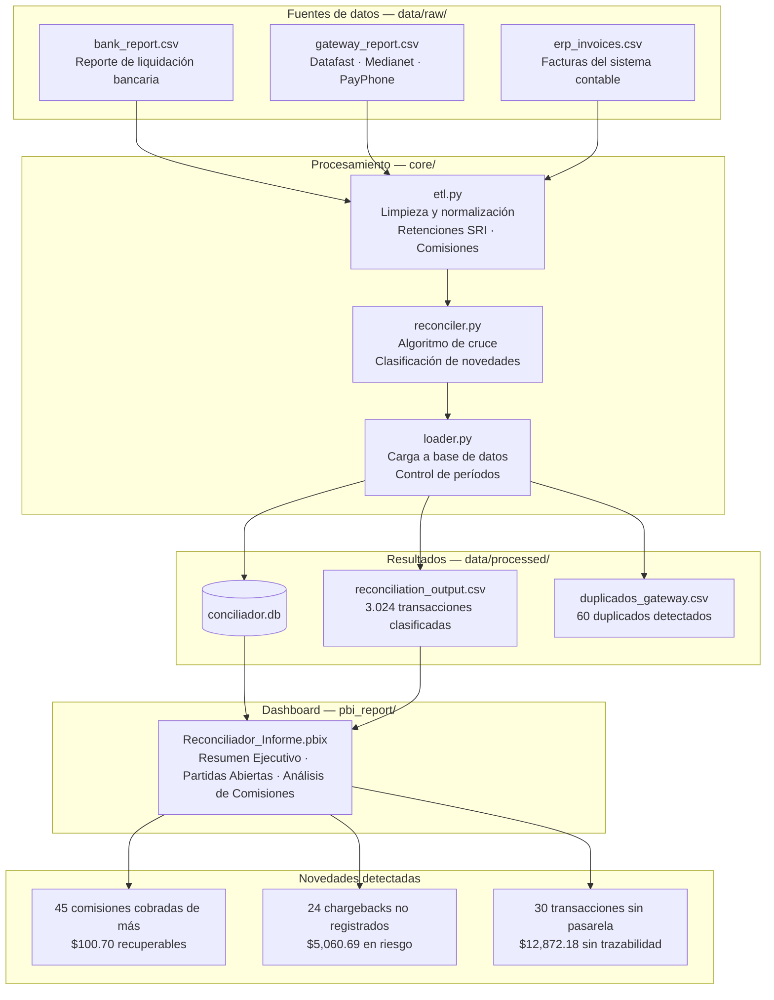

# Conciliador de Pasarelas de Pago
## Qué detecta, por qué importa y cómo actuar


---

## ▶ Demo 

https://github.com/user-attachments/assets/eb61ace0-cf23-4b96-8cc8-fa8a834174bd


---

## Índice

- [El problema que resuelve](#el-problema-que-resuelve)
- [Stack tecnológico](#stack-tecnológico)
- [Pipeline del proyecto](#pipeline-del-proyecto)
- [Estructura del repositorio](#estructura-del-repositorio)
- [Cómo clonar y ejecutar el proyecto](#cómo-clonar-y-ejecutar-el-proyecto)
- [Resultado de ejemplo](#resultado-de-ejemplo--sample_output)
- [Ejecución](#ejecución)
- [Cómo se actualiza el histórico en la base de datos](#cómo-se-actualiza-el-histórico-en-la-base-de-datos)
- [Dashboard de Power BI](#dashboard-de-power-bi--reporte-de-conciliación)
- [Cómo fluye el dinero](#cómo-fluye-el-dinero--la-base-para-entender-las-novedades)
- [Las tres novedades detectadas](#las-tres-novedades-que-el-sistema-detecta) *(detalle completo en [NOVEDADES.md](NOVEDADES.md))*
- [El valor que aporta el proyecto](#el-valor-que-aporta-el-proyecto)
- [Notas para producción](#notas-para-producción)

---

## El problema que resuelve

Tres sistemas deben coincidir al final del mes — el ERP (factura el valor bruto), la pasarela de pago (Datafast, Medianet, PayPhone, que cobra su comisión) y el banco (deposita el neto tras las retenciones del SRI) — pero no se comunican entre sí de forma automática. El equipo contable termina cruzando los reportes a mano, un proceso que con volúmenes medianos toma entre 8 y 20 horas semanales y que, inevitablemente, genera errores humanos.

> **Nota sobre los datos:** Este proyecto usa datos sintéticos generados con Faker. Los nombres de empresas, RUCs y transacciones son ficticios. El problema de negocio que modela — comisiones cobradas de más, chargebacks no registrados, transacciones sin trazabilidad — es completamente real y ocurre en cualquier empresa que procese pagos con tarjeta.

---

## Stack tecnológico

| Capa | Tecnología | Uso |
|---|---|---|
| Procesamiento | Python · Pandas · NumPy | ETL, algoritmo de cruce, detección de novedades |
| Almacenamiento | SQLite · SQLAlchemy | Resultados con histórico por período |
| Visualización | Power BI | Dashboard ejecutivo · Partidas abiertas · Análisis de comisiones |
| Generación de datos | Faker | Datos sintéticos con errores reales inyectados |

---

## Pipeline del proyecto


 
---

## Estructura del repositorio

```
Payment_Reconciler/
│
├── Readme.md
├── .gitignore
├── requirements.txt
├── main.py                         ← punto de entrada del pipeline
│
├── src/
│   ├── config.py                   ← rutas y constantes del negocio
│   └── log_config.py               ← configuración centralizada de logging
│
├── core/
│   ├── etl.py                      ← limpieza y normalización
│   ├── reconciler.py               ← cruce y clasificación
│   └── loader.py                   ← carga a SQLite 
│
├── data/
│   ├── raw/                        ← archivos fuente
│   │   ├── bank_report.csv
│   │   ├── gateway_report.csv
│   │   └── erp_invoices.csv
│   └── processed/                  ← salidas del pipeline
│       ├── reconciliation_output.csv
│       ├── duplicados_gateway.csv
│       └── conciliador.db          
│
├── images/                         ← capturas del proyecto
│
├── sample_output/                  ← resultado de ejemplo (estático, versionado)
│   ├── reconciliation_output.csv
│   ├── duplicados_gateway.csv
│   ├── conciliador.db
│   └── README.md
│
├── log/
│   └── process.log
│
└── pbi_report/
    ├── Reconciliador_Informe.pbix
    └── ux_templates/
        ├── pbi_page_1.JPG          ← Resumen Ejecutivo
        ├── pbi_page_2.JPG          ← Partidas Abiertas
        └── pbi_page_3.JPG          ← Análisis de Comisiones
```
## Cómo clonar y ejecutar el proyecto

**Requisitos previos**

- Python 3.12 o superior
- Git

**Pasos**

```bash
git clone https://github.com/<usuario>/Payment_Reconciler.git
cd Payment_Reconcilier

python -m venv .venv
source .venv/bin/activate     # En Windows: .venv\Scripts\activate

pip install -r requirements.txt
```

El repositorio incluye datos de prueba en `data/raw/` , por lo que el proyecto puede ejecutarse de inmediato sin necesidad de archivos adicionales:

```bash
python main.py
```

Esto genera automáticamente:

- `data/processed/reconciliation_output.csv` y `duplicados_gateway.csv` — resultado de la corrida actual
- `data/processed/conciliador.db` — base de datos histórica (se crea sola si no existe)
- `log/process.log` — registro detallado de la ejecución

Para usar el proyecto con datos reales, se  reemplazan los tres archivos en `data/raw/` (`bank_report.csv`, `erp_invoices.csv`, `gateway_report.csv`) manteniendo exactamente esos nombres, y volver a correr `python main.py`.

> Las carpetas `.venv/`, `__pycache__/` y `log/*.log` están excluidas del repositorio mediante `.gitignore` — cada persona las genera al clonar y ejecutar el proyecto.

---

## Resultado de ejemplo — `sample_output/`

`data/processed/` es la carpeta de trabajo del pipeline, su contenido se sobrescribe en cada corrida y por eso está excluido del repositorio mediante `.gitignore`. Para que cualquiera pueda ver el resultado real sin tener que clonar, instalar dependencias y ejecutar nada, el repositorio incluye una copia estática en `sample_output/`:

- `reconciliation_output.csv` y `duplicados_gateway.csv` — salida de una corrida real sobre los datos sintéticos de `data/raw/`
- `conciliador.db` — la base de datos resultante, se abre directamente con DBeaver, SQLite CLI o cualquier cliente compatible con SQLite

Esta carpeta es una fotografía fija de un momento específico, no un artefacto que se actualiza junto con el código — así lo indica el `README.md` dentro de `sample_output/`. Para obtener un resultado actualizado con el código actual, corre `python main.py` como se explica arriba.

---

## Ejecución

Pensado para que lo opere directamente el responsable de conciliación, sin conocimientos de programación: un `.bat` (o `cron` en Linux) que se ejecuta con doble clic o de forma programada. Una vez configurado el entorno una vez, el proceso semanal se reduce a reemplazar los archivos fuente y correr el script.
 
**Configuración inicial (una sola vez)**
 
```cmd
python -m venv .venv
.venv\Scripts\activate
pip install -r requirements.txt
```
 
**Ejecución semanal**
 
1. Reemplazar los tres archivos fuente en `data/raw/` con los reportes actualizados del banco, la pasarela y el ERP.
2. Ejecutar `ejecutar_conciliacion.bat` con doble clic.
3. Abrir el dashboard en Power BI y presionar **Actualizar**.
```bat
@echo off
cd /d "RUTA_DEL_PROYECTO"
call .venv\Scripts\activate
python main.py
echo Proceso completado. Abre el .pbix y presiona Actualizar.
pause
```
 
El script activa el entorno virtual y corre `main.py`, que orquesta todo el pipeline en un solo paso: concilia, guarda los resultados y actualiza la base de datos. No requiere terminal, ni comandos, ni supervisión técnica .

## Cómo se actualiza el histórico en la base de datos

El pipeline está pensado para correr de forma recurrente (semanal, en este proyecto) sin perder ni duplicar información. Esto se resuelve en `core/loader.py` mediante un mecanismo de actualización por `tx_id`, no por fecha ni por período.

**Por qué no se duplica al correr varias veces**

Los reportes fuente (`bank_report.csv`, `erp_invoices.csv`, `gateway_report.csv`) llegan acumulados desde el inicio del mes hasta la fecha de la corrida — no solo las transacciones nuevas. Esto significa que cada ejecución del pipeline recalcula el estado real y actualizado de todas las transacciones del mes, incluyendo aquellas que estaban pendientes en una corrida anterior y ya se resolvieron. Por ejemplo: una venta que en la semana 1 no tenía contraparte en el banco (quedaba como `PENDIENTE`), y en la semana 2 sí aparece liquidada, se reclasifica automáticamente como `CONCILIADA` sin intervención manual.

Antes de insertar los nuevos resultados, `loader.py` elimina de la base únicamente las filas cuyo `tx_id` coincide con los que trae la corrida actual, y luego inserta el resultado completo. En la práctica esto logra el efecto de una actualización tipo *upsert*: los registros que cambiaron de estado se sobrescriben con su versión más reciente, y los que no cambiaron no se tocan.

---

## Dashboard de Power BI — Reporte de Conciliación

Esta sección presenta las pantalla principal del tablero diseñado en Power BI, el cual automatiza el monitoreo y control del pipeline de conciliación.

### Informe Conciliacion 

Informe que consolida los principales indicadores: montos totales procesados, volumen de transacciones conciliadas y alertas tempranas sobre diferencias detectadas entre las fuentes.Inlcuye tablas con detalles  para el equipo contable enfocado en la investigación de novedades. Permite identificar rápidamente transacciones duplicadas, registros huérfanos o comisiones mal calculadas por la pasarela de pagos.


## Cómo fluye el dinero — la base para entender las novedades

Antes de explicar los errores que el sistema detecta, es importante entender cómo fluye el dinero en cada transacción con tarjeta.

Cuando un cliente paga $500 con su tarjeta Visa, el dinero pasa por tres descuentos antes de llegar al comercio: la comisión de la pasarela, la retención de IVA y la retención en la fuente de renta que exige el SRI.

```
Cliente paga              $500.00
Comisión Datafast (3.5%)  - $17.50
Retención IVA (4.5%)      - $22.50
Retención renta (1%)      - $  5.00
                          ─────────
Depósito recibido         $455.00
```

Este desfase entre lo que registra el ERP ($500) y lo que deposita el banco ($455) es completamente normal y esperado. El conciliador conoce estas reglas y las aplica automáticamente para cada transacción — eso le permite distinguir entre una diferencia esperada y un error real.

---

## Las tres novedades que el sistema detecta

De un total de 3.024 transacciones analizadas en el período julio-diciembre 2024 (3.000 ventas originales + 24 reversiones posteriores), el sistema identificó 99 casos que requieren atención:


```
Transacciones conciliadas correctamente  →  2.925  (96.7%)
Comisiones cobradas de más               →     45  casos
Chargebacks no registrados en ERP        →     24  casos
Transacciones sin confirmar en pasarela  →     30  casos
```

---

| Novedad | Casos | Impacto | Detalle completo |
|---|---|---|---|
| Comisiones cobradas de más | 45 | $100.70 recuperable | [Ver análisis →](NOVEDADES.md#novedad-1--comisiones-cobradas-de-más-por-la-pasarela) |
| Chargebacks no registrados en ERP | 24 | $5,060.69 en riesgo | [Ver análisis →](NOVEDADES.md#novedad-2--chargebacks-no-registrados-en-el-erp) |
| Transacciones sin confirmar en pasarela | 30 | $12,872.18 sin trazabilidad | [Ver análisis →](NOVEDADES.md#novedad-3--transacciones-sin-confirmar-en-la-pasarela) |

📄 **[NOVEDADES.md](NOVEDADES.md)** contiene el detalle de cada novedad: qué significa, por qué ocurre, el impacto contable y cómo lo resuelve el equipo paso a paso.

---

## El valor que aporta el proyecto

Antes de este sistema, un equipo contable dedicaba entre 8 y 20 horas semanales a cruzar manualmente los reportes del banco, la pasarela y el ERP. Aun así, errores como las comisiones cobradas de más o los chargebacks no registrados pasaban desapercibidos porque el volumen de transacciones hace imposible revisar cada línea con atención.

Con el sistema ese trabajo toma menos de un minuto: el pipeline lee los tres reportes, aplica las reglas del SRI y de cada contrato de pasarela, cruza las transacciones y clasifica cada una con su estado y tipo de novedad — entregando un dashboard ejecutivo y un detalle operativo listos para actuar, con los montos recuperables y en riesgo que ya se detallaron arriba.

---

## Notas para producción

```
- Base de datos: SQLite para desarrollo. Cambiar a PostgreSQL modificando
  una línea en loader.py para entornos de producción.

- Histórico: el loader actualiza por tx_id (elimina e inserta solo las
  filas cuyo tx_id coincide con la corrida actual), no por período. Esto
  permite ejecutar el pipeline con la frecuencia que se necesite (semanal
  en este proyecto) sin duplicar registros y sin perder histórico de
  meses anteriores. Ver la sección "Cómo se actualiza el histórico en
  la base de datos" para el detalle completo.

- Aging: calculado con la fecha máxima del dataset. En producción con
  datos del mes actual, cambiar a DateTime.LocalNow() en Power BI.

- Chargebacks: se generan como reversión posterior de la venta original
  (15-45 días después), no como modificación de la transacción existente.
  El client_name y el monto de factura se recuperan automáticamente
  mediante lookup por el identificador de transacción original — ya
  implementado en reconciler.py.

- Eventos posteriores al cierre: el sistema puede detectar reversiones que
  ocurren después del corte del período analizado (subsequent events, un
  caso contable real). Con datos sintéticos, se recomienda que el generador
  excluya de la muestra de chargebacks las ventas de los últimos 45 días
  del período, para evitar reversiones fuera de rango.
```

---

*Desarrollado por Fabricio Coque · Guayaquil, Ecuador*
